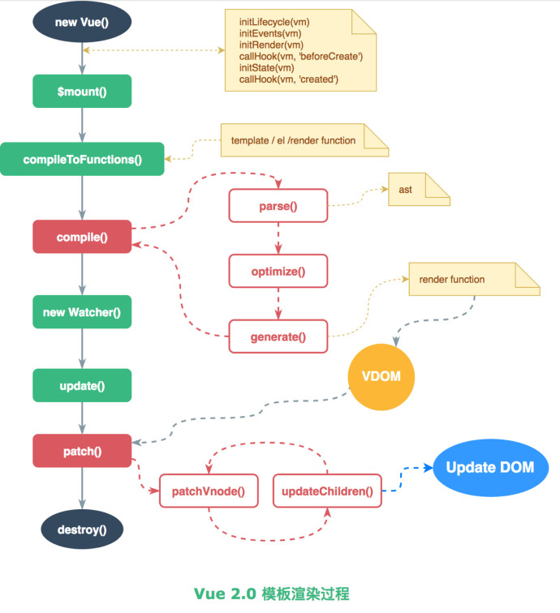

# 目录
- [对mvvm的理解](#对mvvm的理解)
- [vue如何实现响应式](#vue如何实现响应式)
- [vue如何解析模板](#vue如何解析模板)
- [Vue的双向数据绑定原理](#Vue的双向数据绑定原理)

### 对mvvm的理解
- vm为viewModel,连接view和model
- mvvm的三要素
  - 响应式
  - 模版引擎
  - 渲染 （再渲染）

### vue如何实现响应式
- 实现响应式监听
- data代理到vm
  - Object.defineProperty()
```js
var vm={};
var data={name:'yao',age:18}
for(key in data){
  (function(key){
    Object.defineProperty(vm,key,{
      get:function(){
        console.log('监听到get操作,读取数据可以调用的逻辑')
        return data[key];
      },
      set:function(newVal){
        data[key]=newVal;
        console.log('监听到set操作，改变数据时可以调用的逻辑')
      }
    })
  })(key)
}
            
```

### vue如何解析模板



### Vue的双向数据绑定原理

  vue.js 是采用数据劫持结合发布者-订阅者模式的方式，通过Object.defineProperty()来劫持各个属性的setter，getter，在数据变动时发布消息给订阅者，触发相应的监听回调。

具体步骤：

- 1.监听数据变化，对需要observe的数据对象进行递归遍历，包括子属性对象的属性，都加上setter和getter。
- 2.compile解析模板指令，将模板中的变量替换成数据，然后初始化渲染页面视图，并将每个指令对应的节点绑定更新函数，添加监听数据的订阅者，一旦数据有变动，收到通知，更新视图

第三步：Watcher订阅者是Observer和Compile之间通信的桥梁，主要做的事情是:
1、在自身实例化时往属性订阅器(dep)里面添加自己
2、自身必须有一个update()方法
3、待属性变动dep.notice()通知时，能调用自身的update()方法，并触发Compile中绑定的回调，则功成身退。

第四步：MVVM作为数据绑定的入口，整合Observer、Compile和Watcher三者，通过Observer来监听自己的model数据变化，通过Compile来解析编译模板指令，最终利用Watcher搭起Observer和Compile之间的通信桥梁，达到数据变化 -> 视图更新；视图交互变化(input) -> 数据model变更的双向绑定效果。


 

