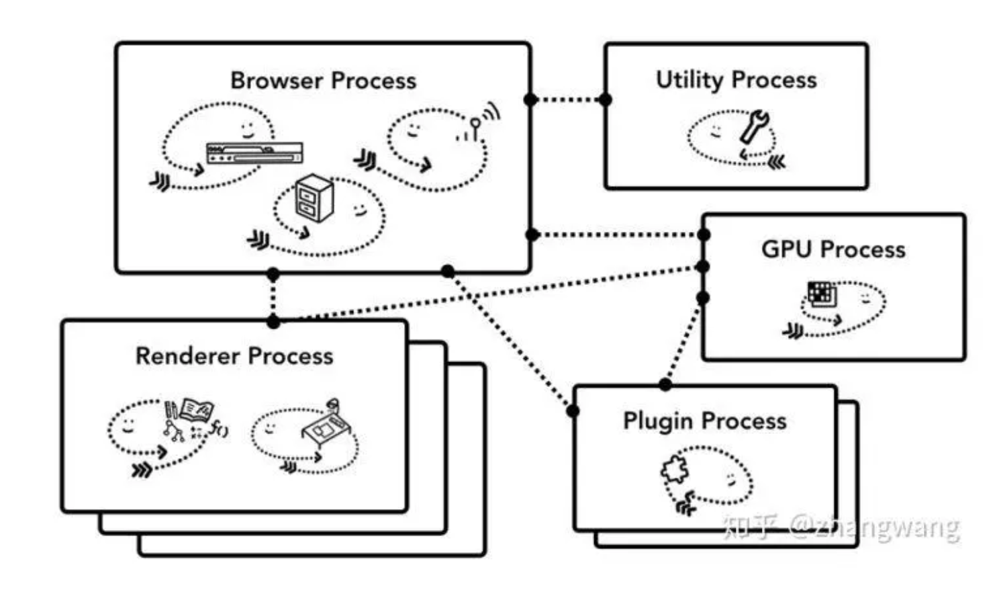

## 目录
- [浏览器的多进程架构](#浏览器的多进程架构)
- [导航](#导航)

### 浏览器的多进程架构

以 Chrome 为例，它由多个进程组成，每个进程都有自己核心的职责，它们相互配合完成浏览器的整体功能，每个进程中又包含多个线程，一个进程内的多个线程也会协同工作，配合完成所在进程的职责。Chrome 采用多进程架构，其顶层存在一个 Browser process 用以协调浏览器的其它进程。

**多进程**

- Browser Process
  - 负责包括地址栏，书签栏，前进后退按钮等部分的工作
  - 负责处理浏览器的一些不可见的底层操作，比如网络请求和文件访问
- Renderer Process
  - 负责一个 tab 内关于网页呈现的所有事情
- Plugin Process
  - 负责控制一个网页用到的所有插件，如 flash
- GPU Process
  - 负责处理 GPU 相关的任务
  
### 导航

***多进程***

浏览器 Tab 外的工作主要由 Browser Process 掌控，Browser Process 又对这些工作进一步划分，使用不同线程进行处理

- UI thread ： 控制浏览器上的按钮及输入框；
- network thread: 处理网络请求，从网上获取数据；
- storage thread: 控制文件等的访问；

 

